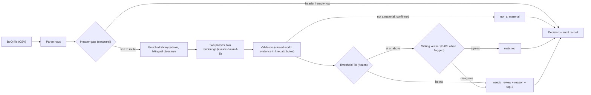

# ORIS material matcher

Maps every line of a construction Bill of Quantities to one exact row of a material library, or sends it to review with a reason, and proves how often it is right.

[](https://github.com/soneeee22000/oris-material-matcher/actions/workflows/ci.yml)
[](https://www.python.org/downloads/release/python-3120/)
[](https://mypy.readthedocs.io/)
[](https://github.com/astral-sh/ruff)
[](https://github.com/soneeee22000/oris-material-matcher/commits)


[Project page](https://oris-material-matcher.vercel.app) · [Results](docs/evaluation.md) · [Design](DESIGN.md) · [Traced cases](docs/traced-cases.md) · [Why](docs/WHY.md)

The project page shows committed real output; it does not run the matcher.

The service maps each line of a Bill of Quantities to an exact `type / usage / subtype` row of an ORIS material library, or decides `not_a_material` or `needs_review`. It reports the evidence for its precision, coverage, cost and latency. The design was pre-registered before any model call ([`DESIGN.md`](DESIGN.md), whose §0 is a one-page summary; v1 is tag `prereg-v1`).

## The claim (lockbox, 113 labelled lines per language)

The single post-freeze session ran on Thu 8 Oct 2026 at the `eval-freeze` tag. The result is **certified at the 90% bar in both languages**, with no material skipped as "not a material".

|                                             | EN            | FR            |
| ------------------------------------------- | ------------- | ------------- |
| Matched precision                           | 98.9% (88/89) | 98.8% (79/80) |
| One-sided 95% exact lower bound             | .948          | .942          |
| Coverage (correct / labelled)               | .779          | .699          |
| False "not a material"                      | 0             | 0             |
| Cost per 100 lines; seconds per routed line | $0.22; 0.63   | $0.21; 0.68   |

In French, the abstention that buys this precision costs about 18 points of coverage against the B2 baseline. Those lines go to review with a reason, never to a wrong match. Accuracy at each hierarchy level, the share of lines per decision, and the figures over the whole output files are in [`docs/evaluation.md`](docs/evaluation.md#the-full-output-files-as-the-brief-asks).

## Why this exists

Each BoQ line has to be tied to one library row, because that row carries the environmental data. A wrong match does not fail loudly: a wrong CO₂ factor is silently attached to real quantities of material and travels into every report built on it. This service is designed for the analyst's side of that trade-off: it matches only when the evidence is strong, sends the rest to `needs_review` with a reason code and a top-2 suggestion, and can explain any decision afterwards from the stored calls. The longer version, layer by layer, is [`docs/WHY.md`](docs/WHY.md).

## How it works



- **Model:** `claude-haiku-4-5-20251001`, k = 2 passes over two renderings of the whole library (no shortlist, D-01), with the E-01 bilingual enrichment (`data/enrichment/global.yaml`, `data/enrichment/fr.yaml`).
- **Validators:** an answer that names no existing row, quotes evidence not in the line, or conflicts with the line's attributes is rejected.
- **Decision:** the frozen threshold `T8` and the E-08 sibling verifier decide what may be matched; everything else goes to `needs_review` with a reason code. The shipped configuration is `config/policy.yaml`.


## Quick start

You need Python 3.12 and [uv](https://docs.astral.sh/uv/). None of the commands below calls a model or needs a key, and each costs $0. `oris demo` and `oris explain` read the committed runs and the files their manifests name, never the ground truth, and write nothing; `oris score` reads the committed output and the ground truth.

```bash
uv sync --locked --all-extras --no-extra retrieval
uv run pytest
uv run oris doctor
uv run oris demo --lang en
uv run oris explain --run runs/submission/20261008T024244Z-de394c39 --item 03.01.0020.
uv run oris score --output output/improved_output_en.csv --reference data/boq_dataset_matched_GT.csv --strict
```

- `oris doctor` checks the config, the model allowlist, the pinned model, prices, keys and both libraries. `oris doctor --live` adds one 2-line call to the primary model, one to the fallback when its key is set, `count_tokens` for every rendering of both libraries, and the rate-limit tier.
- `oris demo` replays the committed lockbox B3 runs (EN `runs/submission/20261008T023928Z-56f85fb8`, FR `runs/submission/20261008T024244Z-de394c39`) and checks them byte for byte against `output/improved_output_{en,fr}.csv`. It prints the rows, the decisions and the replay verdict per language, and exits 1 if a replay is not byte-identical. It only replays: it does not score and has no `--live` option (DESIGN.md A69).
- `oris explain` answers "why did line X get this?": the input text and section path, the decision, the reason code and the rule that fired, each pass's top1 / confidence / evidence, the policy and threshold, the E-08 verifier fields, the matched row and top-2 suggestions, the attributed cost and latency, and every call id with its request SHA-256, stored system prompt and provider request id. `--full` adds each call's user message and raw response; `--json` prints one JSON object with sorted keys; an unknown item exits 2. It refuses a run folder or input whose bytes changed.
- `oris score` is the scorer the brief asks for: it scores any output CSV against any reference CSV with the three label columns.

The brief's command, run offline with the rules-only profile (no key, no model call):

```bash
uv run oris --input input/boq_dataset_input_fr.csv --library data/oris_materials_global.csv --output improved_output_fr.csv --profile b0
```

Without `--profile b0`, a live run over a whole exercise file is refused unless the `eval-freeze` tag is at HEAD. The files hold lockbox items, and they are scored only once, after the freeze.

## Live session

Run an unseen BoQ on the FR library with the brief's literal command (`match` is the default command; it needs `ANTHROPIC_API_KEY` and makes paid calls):

```bash
uv run oris --input new.csv --library data/oris_materials_fr.csv --output out.csv
```

The policy is resolved per (model, library). The pinned model on the FR library is certified by the A10 smoke rule (A70, [`docs/gates/G6.md`](docs/gates/G6.md)):

- it runs the frozen operating point `T8` with the sibling verifier and `data/enrichment/fr.yaml`;
- the run prints `policy_resolution: exact (policy T8)`;
- any other model, or a library with even one byte changed, falls back to the strictest threshold `T1` and logs a warning.

The smoke set passed with 0 closed-world violations, 0 false `not_a_material`, 0 decoy matches and 13 of 18 base positives correct; all 28 of its matches were correct (`eval/smoke_fr_v1_result.md`). It is builder-labelled readiness evidence for FR → FR, not a held-out claim: the certified numbers are the lockbox ones above.

The `eval-freeze` refusal does not apply to this run: it only covers live runs over the two exercise input files, which are refused unless the `eval-freeze` tag is at HEAD. An unseen BoQ is never refused.

A live run of the same input can differ from the replay by up to the measured decision flip rate, because temperature 0 is not bit-deterministic on hosted APIs. On dev, the G3 cold live rerun of the shipped configuration measured 0 decision flips in 199 lines per language (and 0 row flips; [`docs/gates/G3.md`](docs/gates/G3.md) §5).

## Evaluation summary

- **Lockbox:** 120 items per language, 113 labelled, scored once at `eval-freeze`, nothing tuned afterwards. Full report, like-for-like rungs, robustness and the two wrong matches: [`docs/evaluation.md`](docs/evaluation.md).
- **Baseline ladder:** B0 rules only, B1 TF-IDF, B2 one Haiku pass, B3 the shipped system. The dev ladder, the experiment runner and the per-gate details are in [`docs/development-results.md`](docs/development-results.md); every run is in the ledger [`eval/experiments.md`](eval/experiments.md).
- **Outputs:** the files in `output/` are the B3 lockbox outputs, the system's results ([`output/README.md`](output/README.md)).
- **Traced cases:** [`docs/traced-cases.md`](docs/traced-cases.md) walks four lines end to end with `oris explain`: a correct match, a plausible wrong match, an abstention, and a failed call that ends in review (a budget refusal; a provider error takes the same path and is covered by a test).
- **Brief coverage:** [`docs/requirements-traceability.md`](docs/requirements-traceability.md) maps every requirement in the brief to its evidence.

## Engineering

- **Failure handling:** timeouts, rate limits, 5xx, truncation, malformed output, missing, duplicate or swapped items and replay misses never lose a line and never mislabel one silently. The line goes to `needs_review` with an `LLM_FAILURE:<kind>`, `LLM_UNAVAILABLE` or `BUDGET_CAP` reason; a row that only looks like a header goes to `needs_review` with `HEADER_UNCONFIRMED`.
- **Audit trail:** each run writes `runs/<run_id>/` with `calls.jsonl` (one record per attempt, OTel GenAI field names, provider request id, served model, finish reasons, cost, latency), `audit.jsonl` (one record per line), `manifest.json` and the stored system prompts under `prompts/`.
- **API:** FastAPI, `POST /v1/match` on the same `MatchService` as the CLI, plus `GET /health` and `GET /ready`; `/v1/*` needs a Bearer token when `ORIS_API_TOKEN` is set. Run it with `uv run uvicorn --factory oris_matcher.api.app:create_app`.
- **Demo, explain, replay:** `oris demo`, `oris explain` and `oris replay` read recorded runs only, so a reviewer can inspect and re-check every committed decision at $0.
- **LLM boundary:** two thin adapters (Anthropic, OpenAI) behind one port; retry, budget, cost, recording and the response cache live in one wrapper, with no LLM framework or gateway (D-17).
- **CI:** Ubuntu and Windows; ruff check and format, `mypy --strict`, the test suite with an 80% coverage floor on the domain and the service, a clean-clone B0 run checked against the requirements, a byte-identical replay of both lockbox outputs, and a drift check on the project page data (`scripts/export_site_data.py --check`).

## Repository map

```text
src/oris_matcher/   CLI (cli.py), service, domain (parsing, validators, decision table), llm/ adapters, api/, io/ (reader, writer, audit)
config/             policy, models, prices, unit aliases, never-match rules
data/               libraries, ground truth, enrichment
input/ output/      exercise inputs and the B3 lockbox outputs
eval/               scorer, split, selection, smoke scorer, experiment ledger, lockbox log
runs/submission/    the recorded lockbox runs behind output/
docs/               evaluation, gates G1-G6, traced cases, data analysis, protocol, UI spec, brief
site/               the static project page, built from committed files
tests/              unit, contract, property and replay tests
```

## Known weaknesses

- **French coverage pays for French precision.** On the lockbox, B3 matches 79 of 113 labelled French lines correctly, against 99 for the single-pass baseline (McNemar p = .0002). Every line it declines goes to `needs_review` with a reason code and a top-2 suggestion; none is matched wrongly. In English, B3 keeps the baseline's coverage (p = 1.0).
- **Usage confusions inside the right material type survive.** Both lockbox errors are of this kind:
  - railway sub-ballast was matched to ballast aggregates;
  - French _couche de fondation_, the sub-base, was matched to the base layer, although the glossary states the meaning.

  The E-08 verifier reduces this error class but does not remove it.

- **The verifier costs coverage once the enrichment is in place.** On dev, the same enriched votes without the verifier give 218 correct matches against 194, at P .972 and .958. The verifier was kept because that comparison was not registered before its result was seen (`docs/gates/G2.md` O24).
- **The FR library is certified by a smoke set, not a held-out measurement.** The threshold on `data/oris_materials_fr.csv` is certified by A10. That is a 68-line builder-labelled set, owner-reviewed and frozen before its one live run, scored by a pre-registered rule. It shows the operating point is safe on the FR taxonomy (0 decoy matches, 0 wrong matches), but it gives no precision estimate with a useful bound. Only 5 of the 10 `base_exact` lines matched, so expect lower coverage than on the global library.
- **The fallback model is not certified.** If the primary model is unreachable, gpt-4o-mini decides at the strictest threshold, so almost every line goes to review (G2 O26).
- **The lockbox is a same-project holdout.** It is section-held-out and blind to tuning, but it was explored before the split (§10.8). The unseen live BoQ is the only fully blind test.
- **One triggered arm was not run.** `header_context` (6 English errors) did not run before the freeze (G2 O25).
- **Large libraries need retrieval that is not built.** The whole library is shown to the model (D-01), because lexical recall@20 is only .869 in English and .690 in French. Runs apply the D-01 tiers to each rendered library: up to 30k tokens, the whole library; 30k–150k, the whole library with a warning and a cache check; above 150k, an explicit error that names the retrieval switch. The `HybridRetriever` behind the `CandidateProvider` port is designed (§10.5) but not built, so that switch is not yet available.
- **No local model and no memory.** The allowlist admits local ≤ 8B model ids, but no local adapter is built or benchmarked. No conversational or correction memory is used: the classifier is stateless and closed-world, and memory derived from labels would leak (D-02).
- **No UI.** The operator UI is specified in [`docs/ui-spec.md`](docs/ui-spec.md) but not built.

**Provenance.** The model is pinned to `claude-haiku-4-5-20251001`, whose published retirement floor is not before 2026-10-15 (A26); latency was measured at the account's custom rate-limit tier, above tier 4 (`evidence/doctor_2026-10-08.json`). All 252 labelled lines, lockbox included, were profiled during data analysis before the split was frozen. Glossary and enrichment entries carry provenance tags (`standard`, `library`, `dev_error`). The lockbox claim also holds without the lines touched by `dev_error` entries: EN .989, FR .987 (`docs/evaluation.md`). The error-cause labels were produced by a panel of two blind labeller agents and an adjudicator, reviewed by me (κ .844).

## With more time

- Run the triggered `header_context` arm, and label a held-out FR → FR set large enough to bound precision on the French library.
- Register and measure "verifier off, given the enrichment" blind, on fresh votes. It may recover about 24 correct dev matches.
- A carbon-weighted error metric, once ORIS CO₂ factors are available, so that a wrong match is weighted by the size of the carbon mistake.
- The deferred G3 hardening: the full fault matrix with a 429 storm, CLI/API parity over whole files, and the doctor measuring the enriched prompt for budget reservations.
- Build the `HybridRetriever` and measure its recall@k for libraries above 30k tokens, and add and benchmark a local ≤ 8B adapter.
- Reviewer-correction memory keyed by library hash, as a production next step.
- The operator UI with asynchronous jobs (`docs/ui-spec.md`).

## Releases

Each release is an annotated git tag; the lockbox claim belongs to `v1.0`, evaluated at `eval-freeze`, and later releases leave it unchanged. See [`CHANGELOG.md`](CHANGELOG.md).

## Data and licence

The code is by Pyae Sone (Seon). The BoQ inputs, ground truth, libraries and brief in `data/`, `input/` and `docs/exercise-brief.md` belong to ORIS and are included for evaluation.

## Author

Pyae Sone (Seon) · [GitHub](https://github.com/soneeee22000) · [Repository](https://github.com/soneeee22000/oris-material-matcher)
