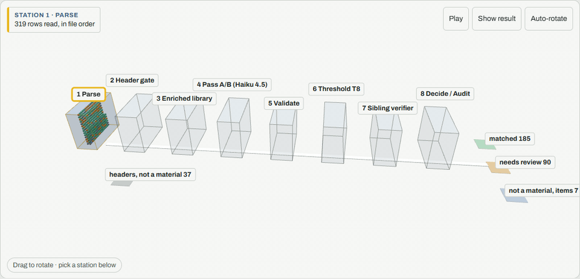
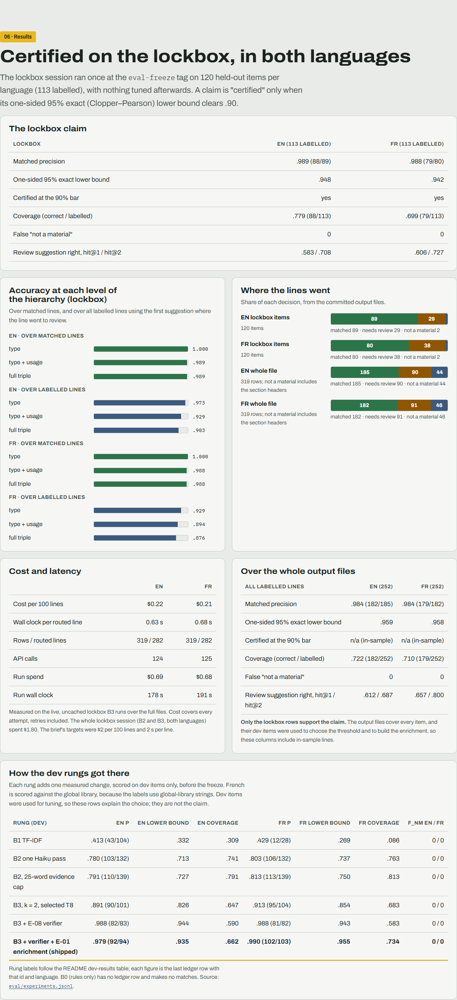
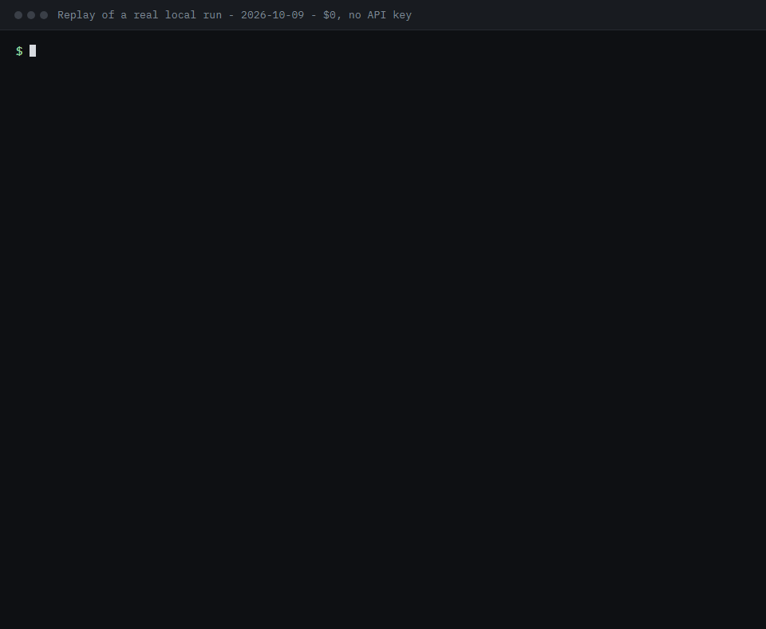
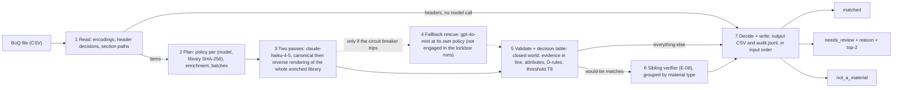

# ORIS material matcher

Maps each line of a construction Bill of Quantities (BoQ) to one exact row of an ORIS material library, or sends it to review with a reason. A held-out test measures how often its matches are right.

[](https://github.com/soneeee22000/oris-material-matcher/actions/workflows/ci.yml)
[](https://www.python.org/downloads/release/python-3120/)
[](https://mypy.readthedocs.io/)
[](https://github.com/astral-sh/ruff)



[Project page](https://oris-material-matcher.vercel.app) · [Results](docs/evaluation.md) · [How it works](#how-it-works) · [Why this exists](#why-this-exists) · [Design](DESIGN.md) · [Data analysis](docs/data-analysis.md) · [Traced cases](docs/traced-cases.md)

The [project page](https://oris-material-matcher.vercel.app) shows committed output from the lockbox runs; it does not run the matcher.

Each line gets exactly one decision:

- `matched`, with a `type / usage / subtype` triple copied verbatim from the selected library;
- `not_a_material`;
- `needs_review`, with a reason code and two suggested rows.

The design, the split and the acceptance rule were pre-registered before any model call (tag `prereg-v1`; [`DESIGN.md`](DESIGN.md) §0 is a one-page summary).

## The result

The lockbox is the held-out test set: 120 items per language, 113 of them labelled. It was scored once, on Thu 8 Oct 2026 at the `eval-freeze` tag, and nothing was tuned afterwards. The result is **certified at the 90% bar in both languages**, with no material skipped as "not a material".

|                                             | EN            | FR            |
| ------------------------------------------- | ------------- | ------------- |
| Matched precision                           | 98.9% (88/89) | 98.8% (79/80) |
| One-sided 95% exact lower bound             | .948          | .942          |
| Coverage (correct / labelled)               | .779          | .699          |
| False "not a material"                      | 0             | 0             |
| Cost per 100 lines; seconds per routed line | $0.22; 0.63   | $0.21; 0.68   |

A routed line is an item line sent to the model; header rows are not routed (282 of 319 rows in English).



Targets from the brief: precision ≥ 90%, $2 per 100 lines, 2 s per line. French precision is paid for in coverage; see [Known weaknesses](#known-weaknesses).

- **Accuracy of matched lockbox lines at each level** (type / type + usage / full triple): EN 1.000 / .989 / .989, FR 1.000 / .988 / .988.
- **Share of lines per decision, whole output files (319 rows):** EN 185 matched (58.0%), 90 needs_review (28.2%), 44 not_a_material (13.8%); FR 182 (57.1%), 91 (28.5%), 46 (14.4%).

## Why this exists

Each BoQ line has to be tied to one library row, because that row carries the environmental data. A wrong match does not fail loudly: a wrong CO₂ factor is silently attached to real quantities of material and travels into every report built on it. A line marked "needs review" costs an analyst a minute; a confident wrong match can cost the credibility of the whole assessment. So the service matches only when the evidence is strong, and it can explain any decision afterwards from the stored calls ([`docs/WHY.md`](docs/WHY.md)).

## Reviewer guide

| Question in the brief                | Short answer                                                                                                                                  | Evidence                                                                                               |
| ------------------------------------ | --------------------------------------------------------------------------------------------------------------------------------------------- | ------------------------------------------------------------------------------------------------------ |
| How well was the data understood     | Usage is the hard level, French is a localised rewrite, and both lockbox errors are the usage confusion the analysis predicted                | [Understanding the data](#understanding-the-data), [`docs/data-analysis.md`](docs/data-analysis.md)    |
| Is there a baseline, how much better | B0 → B1 → B2 → B3 ladder; on the lockbox, B3 makes 1 wrong English match where one Haiku pass makes 21                                        | [Baselines](#baselines), [`docs/evaluation.md`](docs/evaluation.md#like-for-like-on-the-lockbox)       |
| How confident in that number         | One scoring session, frozen beforehand; the claim is a one-sided 95% exact lower bound, not a point estimate                                  | [Evaluation protocol](#evaluation-protocol)                                                            |
| Labelled data at inference time      | Only the enrichment file draws on labels; every entry carries a provenance tag, and the claim holds without the entries added from dev errors | [Evaluation protocol](#evaluation-protocol), [`data/enrichment/`](data/enrichment)                     |
| Are trade-offs explicit              | Precision first, then no lost materials, then coverage; review load is the price, cost and latency are well under budget                      | [Trade-offs](#trade-offs)                                                                              |
| Is it engineered                     | Seven stages, one module each, closed-world validation, fail-closed error paths, an audit record per line, byte-identical replay              | [How it works](#how-it-works), [Engineering](#engineering)                                             |
| Were other models and methods tried  | GPT-4o-mini measured; a post-freeze cross-model vote fails the pre-registered rule; Gemini Flash, embeddings and a local model were not run | [`docs/alternatives.md`](docs/alternatives.md)                                                         |
| Can the choices be defended          | Any decision can be explained from the stored calls at $0                                                                                     | [A traced wrong match](#a-traced-wrong-match), [`docs/traced-cases.md`](docs/traced-cases.md)          |
| How to run it; weaknesses; more time | $0 commands, the live-session command, known weaknesses and what I would do with more time                                                    | [Run it at $0](#run-it-at-0), [Known weaknesses](#known-weaknesses), [With more time](#with-more-time) |

Every requirement in the brief is mapped to its evidence in [`docs/requirements-traceability.md`](docs/requirements-traceability.md).

## Run it at $0

You need Python 3.12 and [uv](https://docs.astral.sh/uv/). None of these commands calls a model or needs a key. `oris demo` and `oris explain` read the committed runs and never the ground truth; `oris score` reads the committed output and the ground truth.

```bash
uv sync --locked --all-extras --no-extra retrieval
uv run pytest
uv run oris doctor
uv run oris demo --lang en
uv run oris explain --run runs/submission/20261008T024244Z-de394c39 --item 03.01.0020.
uv run oris score --output output/improved_output_en.csv --reference data/boq_dataset_matched_GT.csv --strict
```



_Replay of a real local run (2026-10-09). The transcripts are in [`docs/media/transcripts/`](docs/media/transcripts)._

- `oris demo` replays the lockbox B3 runs (EN `runs/submission/20261008T023928Z-56f85fb8`, FR `runs/submission/20261008T024244Z-de394c39`) and checks them byte for byte against `output/improved_output_{en,fr}.csv`; it exits 1 if a replay differs.
- `oris explain` answers "why did line X get this?" It prints the input and section path, the decision with its reason code and rule, each pass's answer and evidence, the threshold, the verifier result and the suggestions. It also prints cost, latency and every call id with its request SHA-256, stored system prompt and provider request id.
- `oris doctor --live` adds one call with two BoQ lines to the primary model (and to the fallback when its key is set), runs `count_tokens` on every rendering and reads the rate-limit tier.

The brief's command on its own French input, offline with the rules-only profile (no key, no model call):

```bash
uv run oris --input input/boq_dataset_input_fr.csv --library data/oris_materials_global.csv --output improved_output_fr.csv --profile b0
```

Without `--profile b0`, a live run on either exercise file is refused unless the `eval-freeze` tag is at HEAD: those files contain the lockbox items, which were scored once, after the freeze.

### Every entry point

The first two rows make paid model calls; the rest are $0.

| Scenario                                   | Command or endpoint                                                 | Model calls                    |
| ------------------------------------------ | ------------------------------------------------------------------- | ------------------------------ |
| Match any BoQ with the same columns        | `oris --input <boq.csv> --library <library.csv> --output <out.csv>` | yes, needs `ANTHROPIC_API_KEY` |
| Same service over HTTP                     | `POST /v1/match`, plus `GET /health` and `GET /ready`               | yes                            |
| Rules-only run, offline                    | `oris ... --profile b0`                                             | none, $0                       |
| Replay the committed lockbox runs          | `oris demo --lang en` / `--lang fr`                                 | none, $0                       |
| Explain why one line got its decision      | `oris explain --run <run> --item <Item No.>`                        | none, $0                       |
| Re-run a recorded run byte for byte        | `oris replay <run> --check <csv>`                                   | none, $0                       |
| Score any output against any reference CSV | `oris score --output <out.csv> --reference <labels.csv> --strict`   | none, $0                       |
| Check config, keys, prices and libraries   | `oris doctor` (`--live` adds a few small calls)                     | none, or a few with `--live`   |

## Live session

Run an unseen BoQ on the FR library with the brief's literal command (`match` is the default command; it needs `ANTHROPIC_API_KEY` and makes paid calls):

```bash
uv run oris --input new.csv --library data/oris_materials_fr.csv --output out.csv
```

The policy is resolved per (model, library). The pinned model on the FR library is certified by a pre-registered smoke test on a 68-line builder-labelled French set (amendments A10 and A70, [`docs/gates/G6.md`](docs/gates/G6.md)):

- it runs the frozen operating point `T8` (one of eight pre-registered threshold candidates, T1–T8, where T1 is the strictest) with the sibling verifier and `data/enrichment/fr.yaml`;
- the run prints `policy_resolution: exact (policy T8)`;
- any other model, or a library with even one byte changed, falls back to the strictest threshold `T1` and logs a warning.

The smoke set passed: 0 closed-world violations, 0 false `not_a_material`, 0 matches on decoy lines, and 13 of 18 base positives correct against a pass bar of 9. All 28 of its matches were correct ([`eval/smoke_fr_v1_result.md`](eval/smoke_fr_v1_result.md)). It is readiness evidence for FR → FR, not a held-out claim; the certified numbers are the lockbox ones above.

The `eval-freeze` refusal covers only the two exercise input files, so an unseen BoQ is never refused.

A live run can still differ from a replay, because temperature 0 is not bit-deterministic on hosted APIs. On dev, two independent live runs of the shipped configuration gave 0 decision flips in 199 lines per language ([`docs/gates/G3.md`](docs/gates/G3.md) §5).

## How it works

Traced from `MatchService.match` in [`src/oris_matcher/service.py`](src/oris_matcher/service.py). The dashed path runs only when the primary model is unavailable.



What each stage did in the English lockbox run (`runs/submission/20261008T023928Z-56f85fb8`, from [`site/data.json`](site/data.json)):

| Stage                       | Code                                                                                                                            | English lockbox run                                                                                          |
| --------------------------- | ------------------------------------------------------------------------------------------------------------------------------- | ------------------------------------------------------------------------------------------------------------ |
| 1 Read                      | [`io/boq_reader.py`](src/oris_matcher/io/boq_reader.py) `read_boq`                                                              | 319 rows: 37 headers, 282 items                                                                              |
| 2 Plan                      | `service.py` `MatchService._plan`                                                                                               | policy `T8`, `data/enrichment/global.yaml`, 42 batches of up to 10                                           |
| 3 Two passes                | `service.py` `_call_passes`, [`prompts/v1/enriched.py`](src/oris_matcher/prompts/v1/enriched.py) `build_enriched_request`                      | 42 + 42 calls to `claude-haiku-4-5-20251001`                                                                 |
| 4 Fallback rescue           | `service.py` `_rescue`                                                                                                          | not engaged in the lockbox runs                                                                              |
| 5 Validate + decision table | [`domain/validator.py`](src/oris_matcher/domain/validator.py), [`domain/decision.py`](src/oris_matcher/domain/decision.py)      | 206 would-be matches (lines that pass validation and the threshold, before the verifier) of 282 routed lines |
| 6 Sibling verifier E-08     | `service.py` `_verify`, [`verification.py`](src/oris_matcher/verification.py)                                                   | 40 calls; 21 lines sent to review, leaving 185 matched                                                       |
| 7 Decide + write            | `service.py` `_Assembly.result`, [`io/writer.py`](src/oris_matcher/io/writer.py), [`io/audit.py`](src/oris_matcher/io/audit.py) | 185 matched, 90 `needs_review`, 44 `not_a_material`; 124 calls in all                                        |

**Reading the IDs.** D0–D10 are the decision-table rules ([`DESIGN.md`](DESIGN.md) §9.5): the first one that fires decides the line, and they are stage 5's D-rules. D-01, D-02… are design decisions, E-01, E-08… experiments, A1, A2… dated amendments to DESIGN.md, and G1, G2, G3, G5 and G6 the gates in [`docs/gates/`](docs/gates). Two of these do work in the pipeline: E-08 is the sibling verifier and E-01 the bilingual library enrichment.

The shipped configuration is [`config/policy.yaml`](config/policy.yaml): `claude-haiku-4-5-20251001`, k = 2 passes over two renderings of the whole library (no shortlist, D-01), threshold `T8`, the E-08 verifier and the E-01 bilingual enrichment (`data/enrichment/global.yaml`, `data/enrichment/fr.yaml`).

## A traced wrong match

Any decision can be explained at $0 from the stored calls. Here is one of the two lockbox errors: the French line `03.01.0020.`. Abridged output; the full transcript, with the policy, signal and call lines, is in [`docs/media/transcripts/`](docs/media/transcripts):

```text
$ uv run oris explain --run runs/submission/20261008T024244Z-de394c39 --item 03.01.0020.
input: 'Couche de fondation en GNT recyclée 0/45, 300 mm, bretelles' | unit m³ | qty 3400 | kind item
section path: 3 Chaussées > 03.01. Couches non liées
decision: matched, reason SIGNAL:T8, rule D9 (score s is at or above the frozen threshold)
pass 1: kind material, top1 T03.U11.S02, top2 T03.U15.S02, confidence 80, evidence 'Granulats de béton recyclé 0/45, bretelles B1–B4'
pass 2: kind material, top1 T03.U11.S02, top2 T03.U15.S02, confidence 80, evidence 'Granulats de béton recyclé 0/45, bretelles B1–B4'
verifier: flagged, so asked (the line would match without it); its top1 T03.U11.S02 agrees with top1 T03.U11.S02, evidence 'Granulats béton recyclé, couche fondation'
matched row: T03.U11.S02 Aggregates / unbound aggregates for base layer / Recycled Aggregates
suggestion 2: T03.U15.S02 Aggregates / unbound aggregates for subbase / Recycled Aggregates
attributed cost $0.002218, latency 2253 ms, model claude-haiku-4-5-20251001
```

_Couche de fondation_ is the sub-base, and the right row was the second choice of both passes. [`docs/traced-cases.md`](docs/traced-cases.md) walks four lines end to end: a correct match, this wrong match, an abstention, and a failed call that ends in review.

## Understanding the data

The full findings, with counts, are in [`docs/data-analysis.md`](docs/data-analysis.md). The ones that shaped the design:

- **Usage is the bottleneck, and it collapses in French** ([§3](docs/data-analysis.md#3-where-hard-lines-concentrate)). The material type is usually clear; the structural element or layer is the decision. Concrete, aggregates and steel are usage-hard; asphalt, cement, C&D waste and excavations are subtype-hard. The lockbox confirms it: matched accuracy is 1.000 at type in both languages and every error is at usage.
- **French is a localised rewrite, not a translation.** Codes and some technical values change, and there are false friends: _couche de fondation_ is the sub-base. One of the two lockbox errors is exactly that line.
- **The two libraries are different taxonomies.** The global library has 342 rows (30 types, 108 type+usage pairs); the FR library has 70 rows (24 types, 39 type+usage pairs) and shares no material type with it apart from a `Custom` placeholder. Nothing is hard-wired to one library: the policy is resolved per (model, library SHA-256).
- **Lexical retrieval would cap accuracy.** Recall@20 is only .869 in English and .690 in French, so the whole library is shown to the model instead of a shortlist (D-01).
- **Some surprises** ([§8](docs/data-analysis.md#8-surprises), [§5](docs/data-analysis.md#5-blank-gt-lines-that-carry-a-material-and-the-decision-policy)): concrete lines rarely say "concrete"; verb-first lines ("Break out", "Remove") are materials in the ground truth, not services; some blank-label lines carry a real material, so coverage is also reported as C₂₆₅, over all material lines ([`docs/evaluation.md`](docs/evaluation.md#the-full-output-files-as-the-brief-asks)).

## Baselines

Four rungs: B0 is rules only, B1 is TF-IDF top-1 matching with a threshold, B2 is one Haiku pass that matches every valid answer, and B3 is the shipped system (two passes, threshold `T8`, sibling verifier, enrichment). P is the precision of matched lines. CP-LB is its one-sided 95% Clopper–Pearson lower bound. C₂₅₂ is correct matches over labelled lines.

**Like for like on the lockbox** (same 113 labelled items per language, [`docs/evaluation.md`](docs/evaluation.md#like-for-like-on-the-lockbox)):

| Rung                                           | EN P (correct/matched) | EN CP-LB | EN C₂₅₂  | FR P (correct/matched) | FR CP-LB | FR C₂₅₂  |
| ---------------------------------------------- | ---------------------- | -------- | -------- | ---------------------- | -------- | -------- |
| B2, one Haiku pass, every valid answer matched | .809 (89/110)          | .737     | .788     | .876 (99/113)          | .813     | .876     |
| **B3, shipped**                                | **.989 (88/89)**       | **.948** | **.779** | **.988 (79/80)**       | **.942** | **.699** |

Coverage is compared on the same items with McNemar's exact test. **EN:** 10 items are correct only under B3 and 11 only under B2 (p = 1.0), so B3 keeps B2's coverage and makes 1 wrong match where B2 made 21. **FR:** 4 items are correct only under B3 and 24 only under B2 (p = .0002), so in French precision is bought with coverage.

**The development ladder** (dev only, before the freeze; 162 items per language, 139 labelled):

| Rung                                          | EN P (correct/matched) | EN CP-LB | EN C₂₅₂  | FR P (correct/matched) | FR CP-LB | FR C₂₅₂  |
| --------------------------------------------- | ---------------------- | -------- | -------- | ---------------------- | -------- | -------- |
| B0 rules only                                 | no matches             | n/a      | .000     | no matches             | n/a      | .000     |
| B1 TF-IDF                                     | .413 (43/104)          | .332     | .309     | .429 (12/28)           | .269     | .086     |
| B2 one Haiku pass                             | .780 (103/132)         | .713     | .741     | .803 (106/132)         | .737     | .763     |
| B3, k = 2, selected `T8`                      | .891 (90/101)          | .826     | .647     | .913 (95/104)          | .854     | .683     |
| B3 + E-08 verifier                            | .988 (82/83)           | .944     | .590     | .988 (81/82)           | .943     | .583     |
| **B3 + verifier + E-01 enrichment (shipped)** | **.979 (92/94)**       | **.935** | **.662** | **.990 (102/103)**     | **.955** | **.734** |

The full ladder, including the evidence-cap rung, is in [`docs/development-results.md`](docs/development-results.md); every run is in the ledger [`eval/experiments.md`](eval/experiments.md). The files in [`output/`](output/README.md) are the B3 lockbox outputs.

## Evaluation protocol

- **Pre-registered.** The split, the threshold candidates, the selection rule and the form of the claim were committed before any model call (`prereg-v1`; the full protocol is [`docs/evaluation-protocol.md`](docs/evaluation-protocol.md)).
- **Selected on dev only.** The threshold `T8`, the verifier and the enrichment were chosen on dev items; the lockbox log is [`eval/lockbox_log.md`](eval/lockbox_log.md).
- **A bound, not a point.** "Certified" means the one-sided 95% Clopper–Pearson lower bound is at least .90.
- **Robust to dev-derived knowledge.** Without the lines touched by enrichment entries added from dev errors, precision is EN .989 (86/87) and FR .987 (74/75) ([`docs/evaluation.md`](docs/evaluation.md#robustness)).
- **Disclosed.** All 252 labelled lines, lockbox included, were profiled during data analysis before the split was frozen. Glossary and enrichment entries carry provenance tags (`standard`, `library`, `dev_error`). The error-cause labels were produced by a panel of two blind labeller agents and an adjudicator, and reviewed by me (Cohen's κ .844 between the two labellers).
- **Reusable scorer.** `oris score` scores any output CSV against any reference with the three label columns, so ORIS can rerun it on its own labels.

## Trade-offs

What was optimised, in order: matched precision with a certified bound, then zero materials lost as `not_a_material`, then coverage under those two.

| Dimension   | Choice                                                                                  | What it costs, measured                                                                                                                                              |
| ----------- | --------------------------------------------------------------------------------------- | -------------------------------------------------------------------------------------------------------------------------------------------------------------------- |
| Precision   | Two passes must agree with quoted evidence; threshold `T8`; sibling verifier            | 98.9% / 98.8% matched precision on the lockbox                                                                                                                       |
| Coverage    | Abstain below the threshold rather than guess                                           | French lockbox coverage .699 against .876 for one pass (p = .0002); English unchanged (p = 1.0)                                                                      |
| Review load | Every declined line goes to review with a reason and two suggestions                    | 90 (28.2%) EN and 91 (28.5%) FR of 319 rows; for the lockbox lines sent to review, the right row is in the two suggestions .708 (EN) / .727 (FR) of the time (hit@2) |
| Cost        | Whole library in the prompt, two passes, a verifier call: spend the budget on precision | $0.22 / $0.21 per 100 lines, against a $2 target; the whole lockbox session cost $1.7982 of a $3.00 cap                                                              |
| Latency     | Batches of 10 lines, cached library prefix, concurrent fan-out                          | 0.63 / 0.68 s of wall clock per routed line, against a 2 s target                                                                                                    |

One cost was accepted knowingly. On dev, the same enriched votes without the verifier give 218 correct matches summed over both languages (P EN .972, FR .958), against 194 with it. The verifier was kept because that comparison was not registered before its result was seen ([`docs/gates/G2.md`](docs/gates/G2.md) O24).

## Engineering

- **Failure handling.** No failure loses a line or mislabels one silently. Timeouts, rate limits, 5xx errors, truncation, malformed output, missing, duplicate or swapped items, and replay misses all send the line to `needs_review` with an `LLM_FAILURE:<kind>`, `LLM_UNAVAILABLE` or `BUDGET_CAP` reason. A row that only looks like a header gets `HEADER_UNCONFIRMED`. [Traced case 4](docs/traced-cases.md) shows one end to end.
- **Closed world.** A triple that is not a row of the loaded library can never be emitted.
- **Audit trail.** Each run writes `runs/<run_id>/` with `calls.jsonl` (one record per attempt, OTel GenAI field names, provider request id, served model, finish reasons, cost, latency), `audit.jsonl` (one record per line), `manifest.json` and the stored system prompts under `prompts/`.
- **API.** FastAPI, `POST /v1/match` on the same `MatchService` as the CLI, plus `GET /health` and `GET /ready`; `/v1/*` needs a Bearer token when `ORIS_API_TOKEN` is set. Run it with `uv run uvicorn --factory oris_matcher.api.app:create_app`.
- **LLM boundary.** Two thin adapters (Anthropic, OpenAI) behind one port; retry, budget, cost, recording and the response cache live in one wrapper, with no LLM framework or gateway (D-17).
- **CI** ([`ci.yml`](.github/workflows/ci.yml)). Ubuntu and Windows: ruff check and format, `mypy --strict`, the test suite with an 80% coverage floor on the domain and the service, a clean-clone B0 run checked against the requirements, a byte-identical replay of both lockbox outputs, and a drift check on the project page data.

```text
src/oris_matcher/   CLI, service, domain (parsing, validators, decision table), llm/ adapters, api/, io/
config/             policy, models, prices, unit aliases, never-match rules
data/               libraries, ground truth, enrichment
input/ output/      exercise inputs and the B3 lockbox outputs
eval/               scorer, split, selection, smoke scorer, experiment ledger, lockbox log
runs/submission/    the recorded lockbox runs behind output/
docs/               evaluation, gates, traced cases, data analysis, protocol, UI spec, brief
site/               the static project page, built from committed files
tests/              unit, contract, property and replay tests
```

## Known weaknesses

- **French coverage pays for French precision.** On the lockbox, B3 matches 79 of 113 labelled French lines correctly, against 99 for the single-pass baseline (McNemar p = .0002). None of the declined lines is matched wrongly; each goes to review with a reason code and two suggestions.
- **Usage confusions inside the right material type survive.** Both lockbox errors are of this kind: railway sub-ballast matched to ballast aggregates, and French _couche de fondation_, the sub-base, matched to the base layer although the glossary states the meaning. The verifier reduces this error class but does not remove it ([`docs/evaluation.md`](docs/evaluation.md#the-two-wrong-matches)).
- **The verifier costs coverage once the enrichment is in place:** 194 correct dev matches with it, 218 without it (see [Trade-offs](#trade-offs)).
- **The FR library is certified by a smoke set, not a held-out measurement.** It shows the operating point is safe on the FR taxonomy (0 decoy matches, 0 wrong matches) but gives no precision estimate with a useful bound. Only 5 of the 10 lines in its `base_exact` subset matched, so expect lower coverage than on the global library.
- **The fallback model is not certified.** If the primary model is unreachable, gpt-4o-mini decides at the strictest threshold, so almost every line goes to review (1 match over the 324 dev items when measured).
- **The lockbox is a same-project holdout.** It is section-held-out and blind to tuning, but it was explored before the split. The unseen live BoQ is the only fully blind test.
- **One triggered arm was not run.** `header_context` (6 English errors) did not run before the freeze (G2 O25).
- **Large libraries need retrieval that is not built.** Up to 30k tokens the whole library is sent. From 30k to 150k it is still sent, with a warning and a cache check. Above 150k the run stops with an error that names the retrieval switch. The `HybridRetriever` behind the `CandidateProvider` port is designed (DESIGN.md §10.5) but not built.
- **Alternatives are only partly measured.** GPT-4o-mini was measured, and as a second voter it fails the pre-registered E-02(d) rule ($0 analysis after the freeze, dev only). Gemini Flash, a multilingual embedding baseline and a local open-weight model were not run, so TF-IDF understates the simple approach in French ([`docs/alternatives.md`](docs/alternatives.md)).
- **No local model, no memory, no UI.** The allowlist admits local ≤ 8B model ids, but no local adapter is built. The classifier is stateless; memory derived from labels would leak (D-02). The operator UI is specified in [`docs/ui-spec.md`](docs/ui-spec.md) but not built.
- **Model pin.** `claude-haiku-4-5-20251001` has a published retirement floor of not before 2026-10-15 (A26); a new model needs its own certified policy. Latency was measured at the account's custom rate-limit tier, above tier 4 (`evidence/doctor_2026-10-08.json`).

## With more time

- Run the triggered `header_context` arm, and label a held-out FR → FR set large enough to bound precision on the French library.
- Register and measure "verifier off, given the enrichment" blind, on fresh votes. It may recover about 24 correct dev matches.
- A carbon-weighted error metric, once ORIS CO₂ factors are available, so that a wrong match is weighted by the size of the carbon mistake.
- Finish the deferred robustness tests from gate G3: a full fault matrix including a burst of 429 rate-limit errors, CLI/API parity over whole files, and `oris doctor` measuring the enriched prompt so budget reservations are exact.
- Measure a multilingual embedding baseline, Gemini Flash as a second voter, and a local ≤ 8B adapter, in that order ([`docs/alternatives.md`](docs/alternatives.md#next-in-order)). Build the `HybridRetriever` and measure its recall@k for libraries above 30k tokens.
- In production, reuse reviewer corrections keyed by library hash. This is excluded here because label-derived memory would leak into the evaluation (D-02).
- The operator UI with asynchronous jobs ([`docs/ui-spec.md`](docs/ui-spec.md)).

## Releases

Each release is an annotated git tag; the submitted version is `v1.3.0`. The lockbox claim belongs to `v1.0`, evaluated at `eval-freeze`, and later releases leave it unchanged. See [`CHANGELOG.md`](CHANGELOG.md).

## Data and licence

The code is by Pyae Sone (Seon). `data/oris_materials_global.csv`, `data/oris_materials_fr.csv`, `data/boq_dataset_matched_GT.csv`, `input/`, `output/boq_dataset_output_sample.csv` and `docs/exercise-brief.md` belong to ORIS and are included for evaluation. The enrichment in `data/enrichment/` is my work but derives from the ORIS libraries. There is no licence file, because the data is not mine to license.

## Author

Pyae Sone (Seon) · [GitHub](https://github.com/soneeee22000) · [Repository](https://github.com/soneeee22000/oris-material-matcher)
